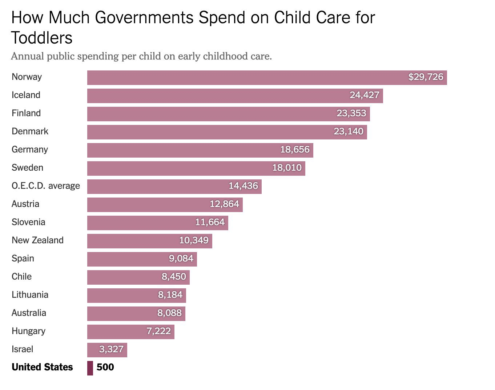
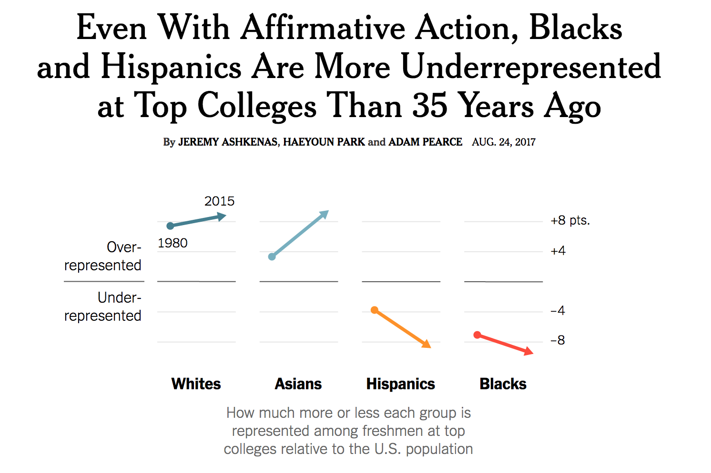
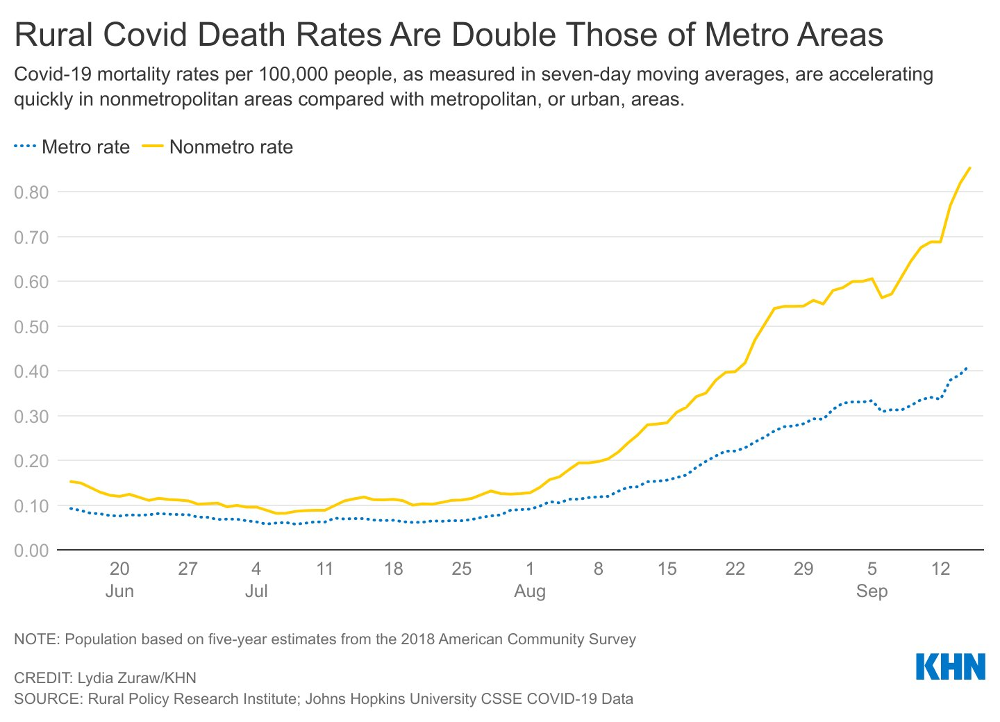
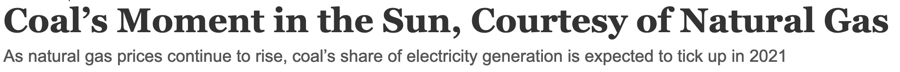
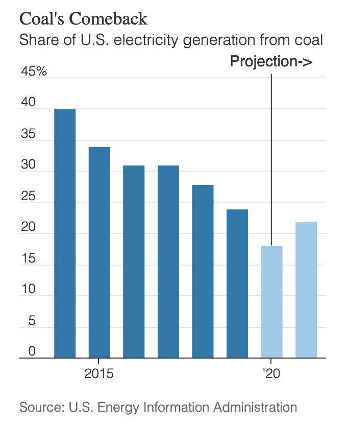
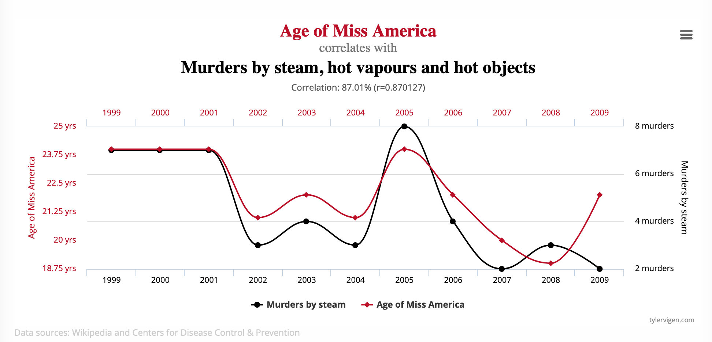

# Data workshop with Nikhil

---

# Happy to be here!

- Who am i?
- Some of my work:
  - [circles](https://qz.com/994486/the-way-you-draw-circles-says-a-lot-about-you)
  - [tea](https://qz.com/1176962/map-how-the-word-tea-spread-over-land-and-sea-to-conquer-the-world)
  - [propaganda department emails](https://qz.com/311832/)

---

# What is "data journalism"?

---

# It's just journalism!

- Data is one source among many (interviews, public statements, primary documents, etc)
- Interrogate data, be skeptical of it, find the truth it holds

---

# Let's look at an example: The Naked Truth

---

# Discussion: [The Naked Truth](https://pudding.cool/2021/03/foundation-names/)

- What's this story about?
- Impressions?
- What role did data play here?
- What would this story be without the data analysis?

---

# Like I said, data is a source: we ask it questions to get answers

---

# Common questions to ask of a dataset:

- what is the most (or least) X? (outliers)
- how has X changed over time?
- how does X compare to Y?
- what is the relationship between X and Y?

---

# Some examples

---

# Outliers

- often the entry point for a larger story
- why is this thing/person/place exceptional?

---

---

---

# Change over time

- what factors account for the change?
- what related things have changed? e.g. laws, leaders, policies, technology, culture
- important: how big is the change?

---

---

# Comparisons (X vs Y)

- highlighting differences that matter
- disproportionate effects

---

---

# Relationships

- what happens to Y when there is more (or less) X?
- be wary: showing relationships is complicated. correlation ≠ causation!

---

---

---

# (Correlation ≠ Causation!)

---

---

# Questions?

---

# Ok, let's start interviewing some data!

---

# 3 datasets provided:

1. Precinct-level voting results for Minnesota 2023 elections
2. Motorized foot scooter trips in Minneapolis, August 2022
3. MPD use of force incidents since Oct 2021

---

# Walkthrough: [Voting results](https://docs.google.com/spreadsheets/d/1-6ANyA-soc1TjeIh7wYaHH5dmwyOYV4in5Dc_5EnjnQ/edit#gid=0)

---

# Group time~

1. **Do a quick scan of each dataset:** What data/columns are available? What jumps out to look further into?
2. **Pick the dataset you're most interested in, and write 3 questions that:** a) you want to know the answer to, and b) your chosen dataset can answer for you
3. **Keep in mind the common questions we discussed:** change over time, outliers, etc.

PS: You don't have to actually answer the questions right now!

---

# Where we go from here

- At home, you'll learn the all-powerful Pivot Table, which will empower you to
  answer questions of datasets
- Next class, we will venture to answer today's questions

Thanks!

